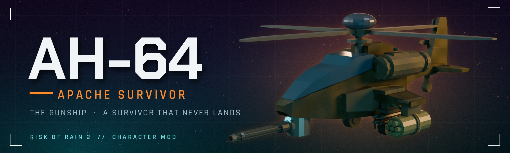
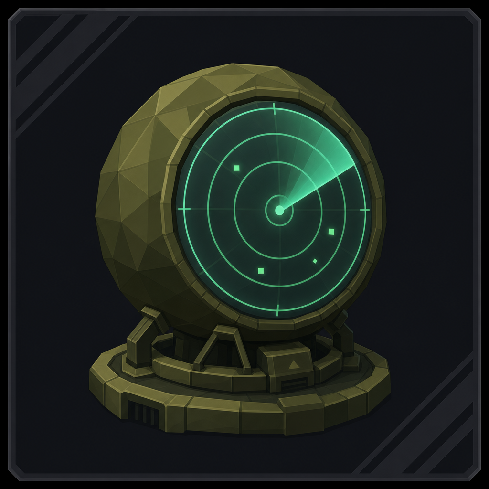
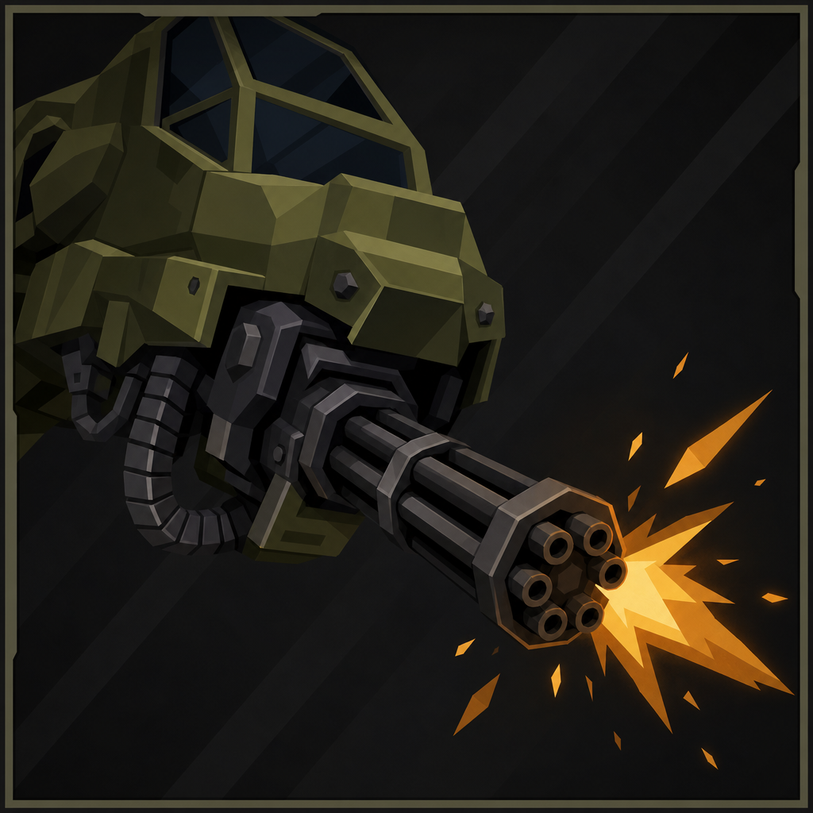
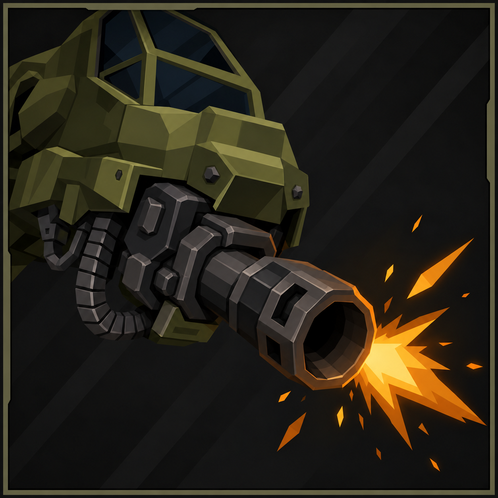
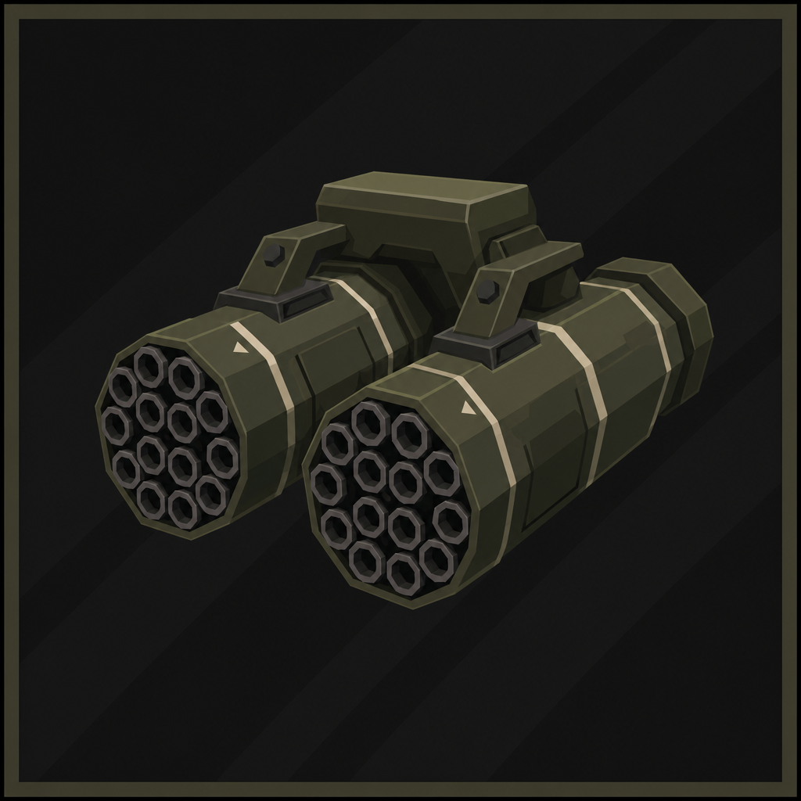
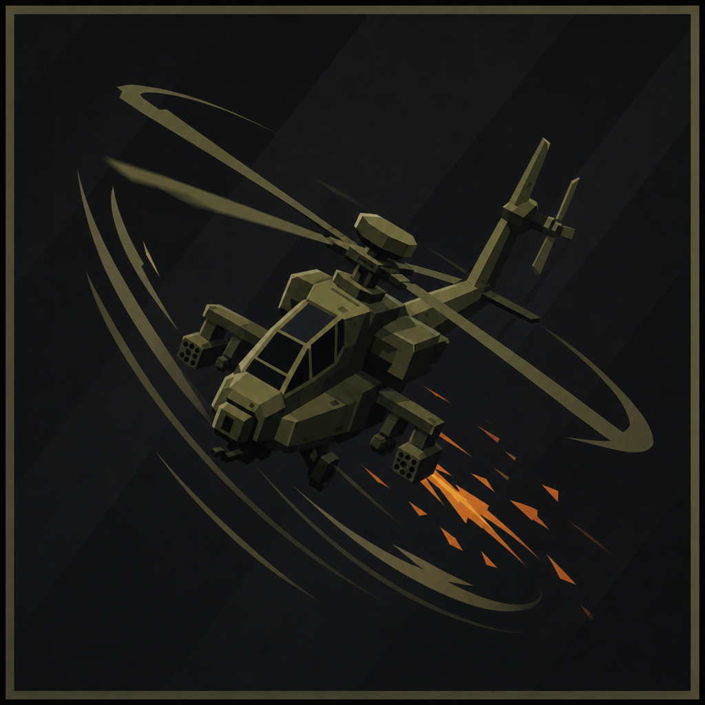
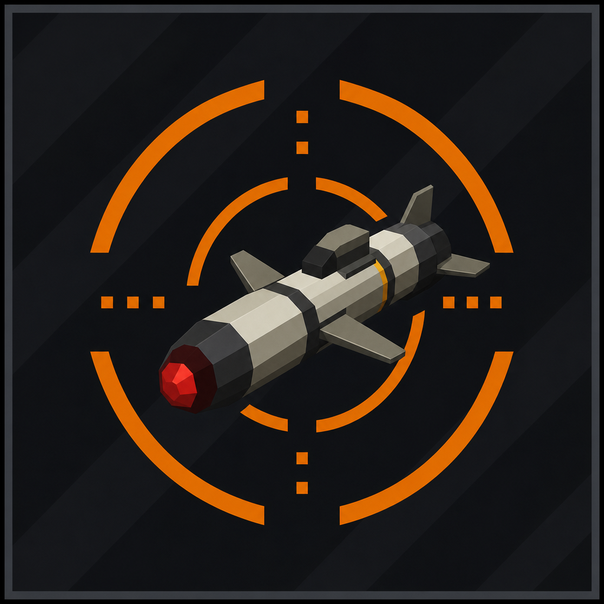
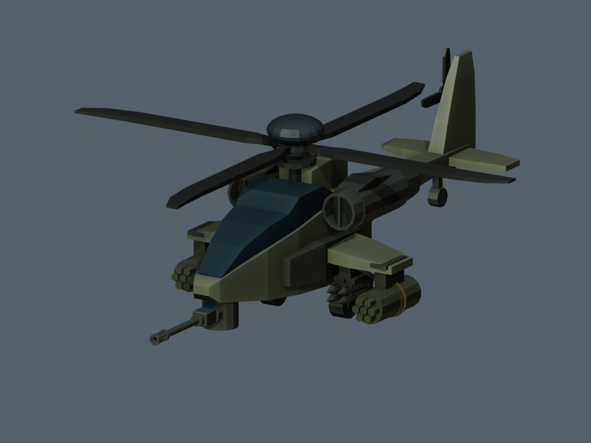
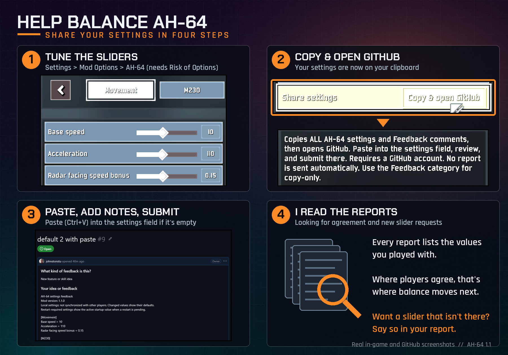

<p align="center">
  
</p>

<p align="center">
  <a href="https://thunderstore.io/c/riskofrain2/p/JohnstonStu/AH64/"></a>
  <a href="https://thunderstore.io/c/riskofrain2/p/JohnstonStu/AH64/"></a>
  <a href="LICENSE"></a>
</p>

> **Early access:** AH-64 is still being tuned. Bug reports, balance settings and run details help shape the next update.
>
> **[Report a bug](https://github.com/johnstonstu/ror2-ah64/issues/new?template=bug_report.yml)** · **[Share balance feedback](https://github.com/johnstonstu/ror2-ah64/issues/new?template=feedback.yml)** · **[Discussions](https://github.com/johnstonstu/ror2-ah64/discussions)**

<h3 align="center">The Gunship. A survivor that never lands.</h3>

The **AH-64** hovers above terrain and strafes like a ground character, with temporary altitude from collective input and evasive maneuvers. Its chin turret tracks the radar target while you reposition.

**In 1.1:** distinct models for all three primaries, immediate weapon previews in character select, Olive/Desert/Arctic paint schemes, responsive rotor audio, and optional balance controls with a shareable settings report.

[Thunderstore](https://thunderstore.io/c/riskofrain2/p/JohnstonStu/AH64/) · [Changelog](CHANGELOG.md) · [Help balance AH-64](#help-balance-ah-64)

## The kit

| Slot | Skill | What it does |
| :---: | --- | --- |
| <br>**Passive** | **Fire Control Radar** | Paints the strongest nearby threat. The chin turret tracks independently of where you are looking, so the gun stays on target while you reposition. |
| <br>**Primary** | **M230 Chain Gun** | A fixed drum that reloads all at once rather than trickling. Tap at range to keep the burst tight; hose the whole drum up close where the spread stops mattering. The reload runs whether or not you emptied it, so top up before you commit. Attack speed helps the reload, not just the fire rate. |
| <br>*Primary variant* | **XM301 Rotary Cannon** | The gatling alternative to the M230: a six-barrel rotary cannon. |
| <br>*Primary variant* | **M789 Heavy Cannon** | A low-rate, high-damage cannon. |
| <br>**Secondary** | **Hydra-70 Pods** | A ripple salvo spread over most of a second — hold your aim through it. Runs on its own cooldown and stays available while the primary is reloading. |
| <br>**Utility** | **Evasive Roll** | A climbing forward-diagonal barrel roll with i-frames through the motion. Hold jump for altitude; hold back or down to dump height faster. |
| *Utility variant* | **Smoke Backflip** | A smoke backflip in place of the roll. |
| <br>**Special** | **AGM-114L Longbow** | Hold to paint radar locks while you keep firing the gun and the Hydras, then release to launch. |
| *Special variant* | **AGM-114 Hellfire** | An aimed, unguided missile fired from the wing rails. Can launch while the primary keeps firing. |

## Choose your gunship

Each primary has its own chin-mounted assembly. Changing your loadout updates the lobby model immediately; Olive, Desert and Arctic skins carry through into gameplay.

<p align="center">
  
</p>

*Blender model preview; in-game lighting varies. The title banner is promotional artwork from an earlier airframe revision.*

## Install

**Mod manager (recommended):** install with [r2modman](https://thunderstore.io/c/riskofrain2/p/ebkr/r2modman/) or Thunderstore Mod Manager. Required dependencies are installed automatically.

**Manual:** copy the package's `plugins` contents into `BepInEx/plugins/JohnstonStu-AH64/`. Keep this layout:

```text
JohnstonStu-AH64/
  AH64.dll
  AssetBundles/ah64
  SoundBanks/AH64Rotor.bnk
```

Everyone in a lobby needs the **same mod version**. Gameplay tuning is local, so agree on matching settings before a multiplayer run.

### Required dependencies

- `bbepis-BepInExPack-5.4.1905`
- `RiskofThunder-R2API_Core-5.0.3`
- `RiskofThunder-R2API_Prefab-1.0.1`
- `RiskofThunder-R2API_RecalculateStats-1.0.0`
- `RiskofThunder-R2API_Language-1.0.1`
- `RiskofThunder-R2API_Sound-1.0.2`

## Help balance AH-64

I want AH-64 to feel right, and the quickest way there is seeing what you actually play with. Your settings show me where players agree on balance, and they're the place to ask for sliders that don't exist yet.

The tuning menu needs [Risk of Options](https://thunderstore.io/c/riskofrain2/p/Rune580/Risk_Of_Options/). It's optional: AH-64 runs on its defaults without it.

<p align="center">
  
</p>

1. Open **Settings → Mod Options → AH-64** and tune the sliders. The tabs are Movement, M230, XM301 Gatling, M789 Cannon, Utility, Presentation, Audio and Feedback. Base speed, acceleration, primary reload times and Evasive Roll cooldown apply after a restart.
2. Optional: add notes in **Feedback → Comments**.
3. At the end of any tab, press **Share settings → Copy & open GitHub**. Your settings report (every AH-64 setting plus your comments) is now on your clipboard, and the feedback form opens on GitHub.
4. The **AH-64 settings and comments** field is usually prefilled. If it's empty, just paste (**Ctrl+V**) into it. The report is already on your clipboard. Then fill in **What kind of feedback** and **Your idea**, including what felt too strong or too weak.
5. Click **Create**.

**Feedback → Copy all settings** copies the same report without opening a browser.

**Privacy:** nothing is sent automatically. The buttons copy to your clipboard and open the form; a prefilled form carries the report in its link, but nothing is posted until you click **Create**. Submitting needs a GitHub account.

### Bugs, ideas and questions

- **Bug:** [open a bug report](https://github.com/johnstonstu/ror2-ah64/issues/new?template=bug_report.yml). Include the version, reproduction steps, stage, host/client role, and your `BepInEx/LogOutput.log` or profile code.
- **Balance or a concrete feature request:** [open the feedback form](https://github.com/johnstonstu/ror2-ah64/issues/new?template=feedback.yml). Paste a settings report when discussing balance.
- **General discussion:** [ask a question](https://github.com/johnstonstu/ror2-ah64/discussions/categories/q-a), [share how it feels](https://github.com/johnstonstu/ror2-ah64/discussions/categories/general), or [suggest an idea](https://github.com/johnstonstu/ror2-ah64/discussions/categories/ideas).

## Known limitations

- Missile rack depletion reflects local special stock, including Longbow reservations while painting locks. Remote and late-join presentation still needs dedicated verification.
- Gameplay tuning is not synchronized between players.
- Deep drops beyond the ground sensor use normal falling physics. Jump-pad and lift handling has been improved; report any remaining stage-specific problems.
- Laser-guided Hellfire is deferred. The current Hellfire variant is unguided; Longbow supplies radar-guided fire.

## Credits and license

- Built with R2API and the Risk of Rain 2 modding community's survivor framework.
- Airframe and weapon geometry modelled from scratch in Blender for this mod.
- Current rotor loop: **“Helicopter Sounds” by aquinn**, CC0. Full provenance and processing notes are in [Art/Audio](Art/Audio/README.md) and the bundled `LICENSE_SOURCE.txt`.
- Legacy rotor recordings by **qubodup** are CC0; their provenance remains documented. Other gameplay sounds use vanilla Risk of Rain 2 Wwise events.

[MIT](LICENSE) © 2026 Stu Johnston. Third-party audio retains its CC0 license.

See the [changelog](CHANGELOG.md) for version history.

---

<details>
<summary><b>Building from source</b></summary>

Use Unity **2021.3.33f1**, Built-In pipeline, the .NET SDK and Wwise **2023.1.4.8496** (bank format 150). Read [AGENTS.md](AGENTS.md) before changing models or bundle inputs. [Development notes](docs/development/README.md) cover audio, model constraints, tooling and release checks.

### 1. Build the Unity assetbundle

Open `AH64UnityProject` with the project path pinned. For the standalone Windows editor:

```powershell
& "C:/Program Files/Unity 2021.3.33f1/Editor/Unity.exe" -projectPath "<repo>/AH64UnityProject"
```

Run **AH64 → Build AssetBundle** (`Ctrl+Alt+B`). Output: `AH64UnityProject/AssetBundles/ah64`. Use only this Unity version to avoid asset migration. Profile writes are opt-in.

### 2. Build the soundbank and plugin

From the repository root:

```powershell
powershell -ExecutionPolicy Bypass -File tools/build-rotor-bank.ps1
dotnet build AH64Mod/AH64.csproj -c Release /p:AH64DeployToProfiles=false
```

The bank script accepts `-WwiseConsole` for another installation path. Ship only `AH64Rotor.bnk`; never the authoring project's `Init.bnk`. See [Art/Wwise/README.md](Art/Wwise/README.md).

Plugin dependencies come from NuGet. Builds stage the DLL in `Build/plugins/`; automatic profile deployment defaults off.

### 3. Check and package

```powershell
powershell -ExecutionPolicy Bypass -File tools/check-feedback.ps1
powershell -ExecutionPolicy Bypass -File tools/check-weapon-previews.ps1
powershell -ExecutionPolicy Bypass -File tools/pack.ps1 -SkipBuild
```

The package script validates version parity, asset freshness, the soundbank, icon size and ZIP layout. It writes `dist/AH64-<version>.zip` and does not upload anything. Test that ZIP in a fresh mod-manager profile before release.

`AH64Plugin.MODVERSION` and `Build/manifest.json` must agree and use plain `major.minor.patch`. Generated DLLs, bundles, soundbanks and ZIPs are ignored; a fresh clone must rebuild them.

| Path | Contents |
| --- | --- |
| `AH64Mod/` | C# BepInEx plugin |
| `AH64UnityProject/` | Unity project and bundle sources |
| `Art/Blender/` | Procedural airframe and weapon source |
| `Art/Audio/`, `Art/Wwise/` | Rotor provenance and bank authoring project |
| `Build/` | Thunderstore README, manifest and icon |
| `tools/` | Build, package and verification helpers |

</details>
