<p align="center">
  
</p>

<p align="center">
  <a href="https://thunderstore.io/c/riskofrain2/p/JohnstonStu/AH64/"></a>
  <a href="https://thunderstore.io/c/riskofrain2/p/JohnstonStu/AH64/"></a>
  <a href="LICENSE"></a>
</p>

<p align="center"><b>An AH-64 Apache attack helicopter survivor for Risk of Rain 2.</b></p>

<p align="center">Enjoying it? Please <a href="https://thunderstore.io/package/JohnstonStu/AH64/">like AH64 on Thunderstore</a> so other players can find it.</p>

> **Early access:** AH-64 is still being tuned. Bug reports, balance settings and run details help shape the next update.
>
> **[Report a bug](https://github.com/johnstonstu/ror2-ah64/issues/new?template=bug_report.yml)** · **[Share balance feedback](https://github.com/johnstonstu/ror2-ah64/issues/new?template=feedback.yml)** · **[Discussions](https://github.com/johnstonstu/ror2-ah64/discussions)**

<h3 align="center">The Gunship. A survivor that never lands.</h3>

The **AH-64** hovers above terrain and strafes like a ground character, with temporary altitude from collective input and evasive maneuvers. Its chin turret tracks the radar target while you reposition.

**What's new in 1.3**

- **Guide your Hellfire.** Press Special to launch, hold to accelerate and steer the live lead missile toward your aim, release to slow it, and hold again to resume guiding that same missile without spending another charge. Your gun and Hydras stay available.
- **Banked Break.** A sweeping 90-degree utility turn that keeps you moving. Choose left or right with movement input; neutral input turns right. Aim and fire through the turn.
- **Shape a Bombing Run with your flight path.** Drop six bombs over 1.5 seconds while moving and using your other weapons or utility. Each enemy can take at most three bomb hits per run; interrupted drops are lost.
- **Momentum through maneuvers.** Evasive Roll and Smoke Backflip carry your entry motion into the maneuver and ease back into normal flight.
- **Build a visibly different gunship.** Special and utility choices now have their own attachments in character select and gameplay, with distinct illustrated loadout icons. The M230 now carries a 20-round drum.

**Still aboard from 1.2:** altitude hold and airtime, item compatibility improvements, five paint schemes, and an airframe that banks, recoils, smokes and crashes.

[Thunderstore](https://thunderstore.io/c/riskofrain2/p/JohnstonStu/AH64/) · [Changelog](CHANGELOG.md) · [Help balance AH-64](#help-balance-ah-64)

## Flight controls

Hold **jump** to climb and **descend** (default **B on controller**, **C on keyboard**) to drop. Release both to hold your altitude. Above resting height, airtime drains according to how you fly; returning to resting height refills it. Extra jumps extend airtime and climb height. The small tick below the crosshair shows your remaining airtime.

The optional **Classic altitude controls** setting restores release-jump-to-descend controls without the airtime limit.

## The kit

Skill values below describe the default settings. Older clips are labeled as historical; their visuals and tuning may differ from 1.3.

### Passive — Fire Control Radar


Paints the strongest nearby threat. Deal 12% more damage to the painted target, gain 15% movement speed while facing it, and 30 armor while close. The chin turret tracks independently of where you look.

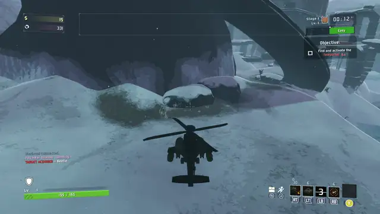

*Historical pre-1.3 footage.*

### Primary — M230 Chain Gun

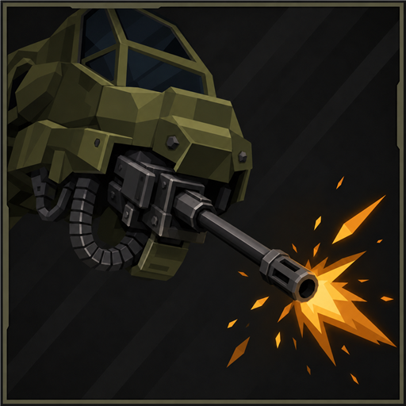

A 20-round drum that reloads all at once. Rounds and the HE blast deal 75% damage within 10m and full damage from 30m. Tap at range to keep the burst tight. Attack speed helps both firing and reloading.

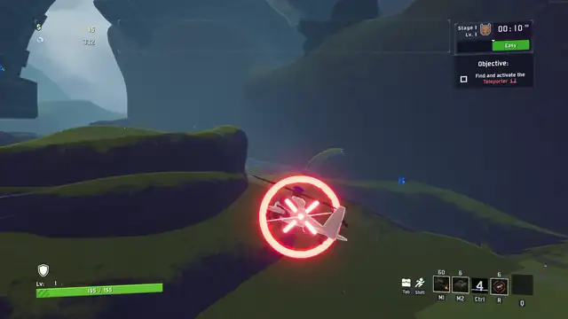

*Historical pre-1.3 footage.*

### Primary variant — XM301 Rotary Cannon

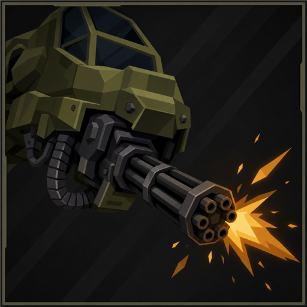

A six-barrel rotary cannon that spools up to about 18 rounds a second from a 60-round drum. Lighter rounds and blasts than the M230, with the same 75% damage within 10m rising to full at 30m.

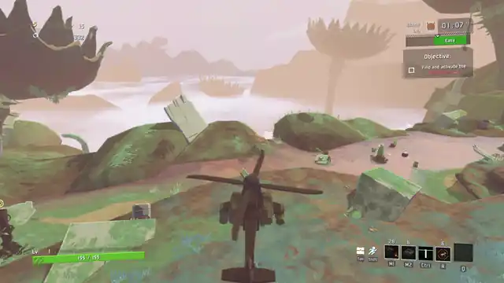

*Historical pre-1.3 footage.*

### Primary variant — M789 Heavy Cannon

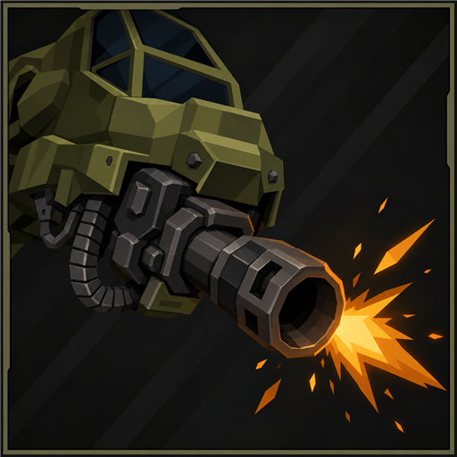

Slow, heavy shells at 2.5 shots a second, each with a large blast. Eight to a magazine, and every shot kicks the airframe.

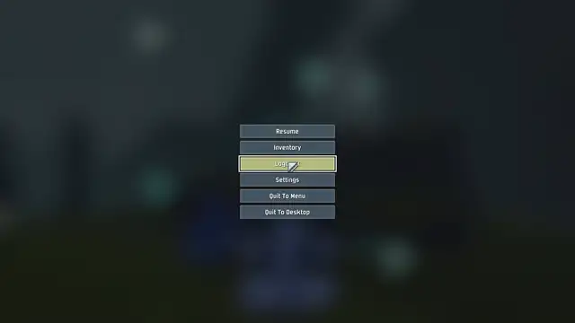

*Historical pre-1.3 footage.*

### Secondary — Hydra-70 Pods

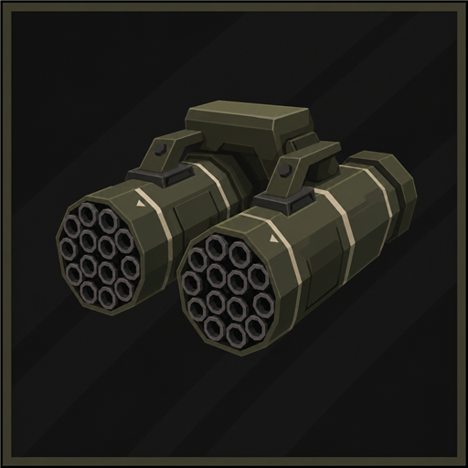

A ripple salvo spread over most of a second: keep your aim on target through it. Rockets deal 75% damage within 8m of flight and full damage from 25m. Each rocket past the base six adds 0.8s to the reload. The pods stay available while your primary reloads.

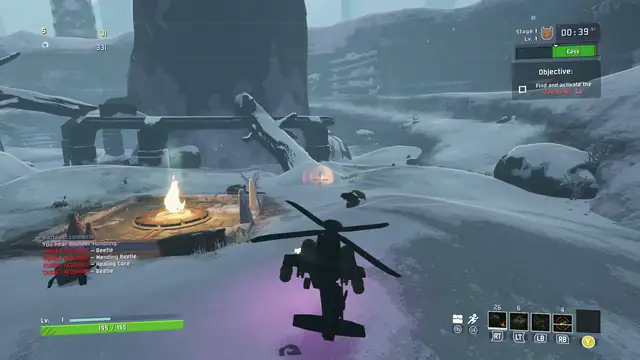

*Historical pre-1.3 footage.*

### Utility — Evasive Roll

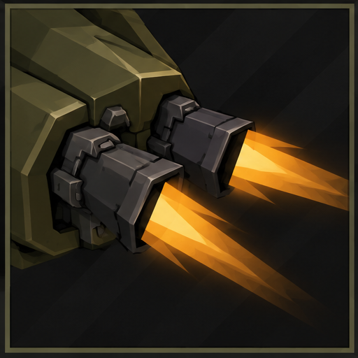

A climbing forward-diagonal barrel roll chosen with movement input, with invulnerability through the first half and 200 armor for the roll (about 0.95s). Carries entry momentum through a smooth speed ramp and back into flight.

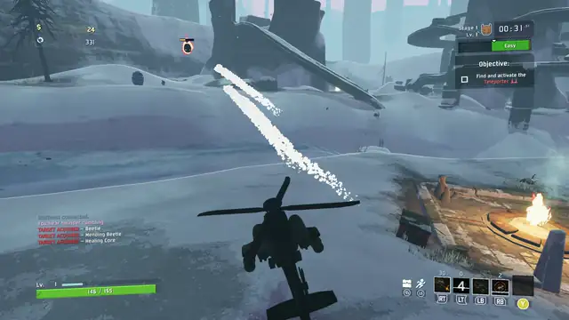

*Historical pre-1.3 footage.*

<!-- AH64_130_MEDIA_UTILITIES -->

### Utility variant — Smoke Backflip

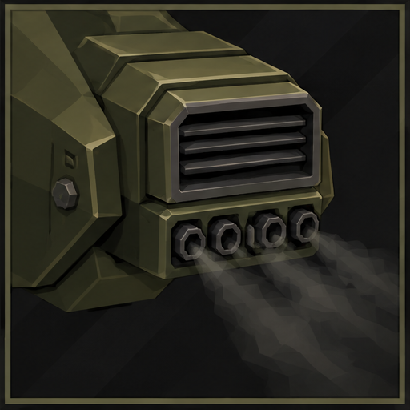

Surge rearward through a climbing pitch loop, dumping smoke and cloaking briefly. Carries entry momentum through the maneuver and eases back into flight.

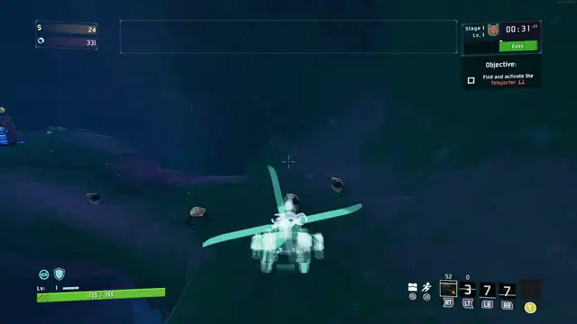

*Historical pre-1.3 footage.*

### Utility variant — Banked Break

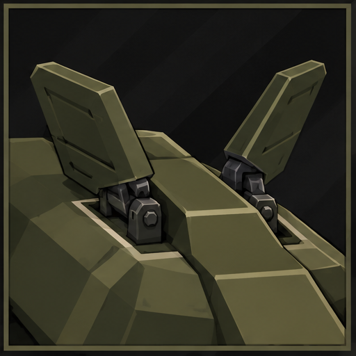

Bank through a sweeping 90-degree turn while maintaining flight. Choose left or right with movement input; neutral input turns right. Aim and fire throughout. Cooldown: 4 seconds.

<!-- AH64_130_MEDIA_BANKED_BREAK -->

### Special — AGM-114L Longbow

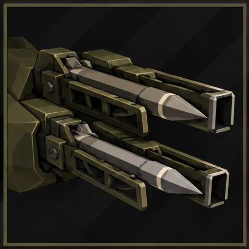

Hold to paint radar locks while you keep firing your gun and Hydras, then release to launch. The base rack holds six missiles; Lysate Cell adds one per stack. Per-missile damage stops climbing after the sixth lock.

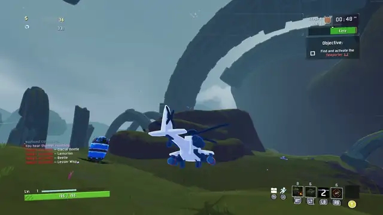

*Historical pre-1.3 footage.*

### Special variant — AGM-114 Hellfire

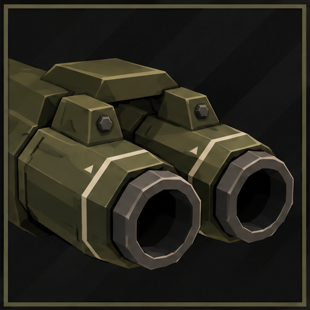

Press Special to launch a slow lead missile. Hold Special to show the targeting laser and accelerate that missile toward your aim; release to slow it, then hold again to resume guiding the same live missile without spending stock. A fresh missile can launch once the previous lead ends. Primary and secondary stay available. Pocket I.C.B.M. adds two ballistic, unguided fan missiles; only the lead follows your laser.

<!-- AH64_130_MEDIA_GUIDED_HELLFIRE -->

### Special variant — Bombing Run

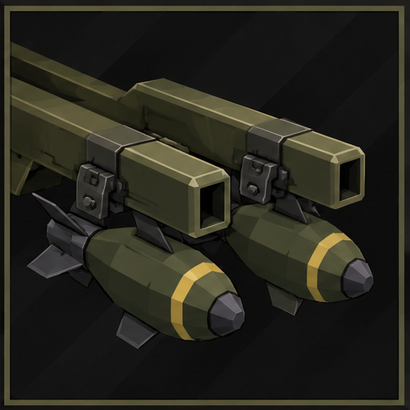

Drop six bombs at 0.3-second intervals along the path you fly. Each deals 300% damage in a 6m blast, with at most three hits per enemy per run. Keep flying, aiming and using your primary, secondary or utility to shape the pattern. Interrupted drops are lost. Cooldown: 10 seconds.

<!-- AH64_130_MEDIA_BOMBING_RUN -->

## Choose your gunship

Each primary has its own chin-mounted assembly. Special choices add open Longbow rails, enclosed Hellfire launchers or bomb carriers; utilities add their own thrusters, smoke canister or banking fins. Changing the loadout updates the character-select model and the live aircraft. Each active skill has a distinct illustrated icon.

<!-- AH64_130_MEDIA_MODULAR_LOADOUTS -->

Five paint schemes carry through into gameplay: Olive, Desert Tan, Arctic, Army Green, and Night Stalker, unlocked by the AH-64 Mastery achievement (beat the game or obliterate on Monsoon).

<p align="center">
  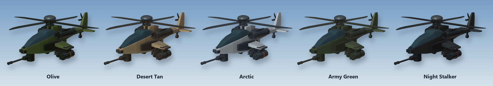
</p>

*Historical 1.2 Blender model preview; in-game lighting varies. The title banner is promotional artwork from an earlier airframe revision.*

## Install

**Mod manager (recommended):** install with [r2modman](https://thunderstore.io/c/riskofrain2/p/ebkr/r2modman/) or Thunderstore Mod Manager. Required dependencies are installed automatically.

**Manual:** copy the package's `plugins` contents into `BepInEx/plugins/JohnstonStu-AH64/`. Keep this layout:

```text
JohnstonStu-AH64/
  AH64.dll
  AssetBundles/ah64
  SoundBanks/AH64Rotor.bnk
```

Everyone in a lobby needs the **same mod version**. Gameplay tuning is local, so agree on matching settings before a multiplayer run.

### Required dependencies

- `bbepis-BepInExPack-5.4.1905`
- `RiskofThunder-R2API_Core-5.0.3`
- `RiskofThunder-R2API_Prefab-1.0.1`
- `RiskofThunder-R2API_RecalculateStats-1.0.0`
- `RiskofThunder-R2API_Language-1.0.1`
- `RiskofThunder-R2API_Sound-1.0.2`

## Help balance AH-64

I want AH-64 to feel right, and the quickest way there is seeing what you actually play with. Your settings show me where players agree on balance, and they're the place to ask for sliders that don't exist yet.

The tuning menu needs [Risk of Options](https://thunderstore.io/c/riskofrain2/p/Rune580/Risk_Of_Options/). It's optional: AH-64 runs on its defaults without it.

<p align="center">
  
</p>

1. Open **Settings → Mod Options → AH-64** and tune the sliders. The tabs are Movement, M230, XM301 Gatling, M789 Cannon, Utility, Presentation, Audio and Feedback. Base speed, acceleration, primary reload times and Evasive Roll cooldown apply after a restart.
2. Optional: add notes in **Feedback → Comments**.
3. At the end of any tab, press **Share settings → Copy & open GitHub**. Your settings report (every AH-64 setting plus your comments) is now on your clipboard, and the feedback form opens on GitHub.
4. The **AH-64 settings and comments** field is usually prefilled. If it's empty, just paste (**Ctrl+V**) into it. The report is already on your clipboard. Then fill in **What kind of feedback** and **Your idea**, including what felt too strong or too weak.
5. Click **Create**.

**Feedback → Copy all settings** copies the same report without opening a browser.

**Privacy:** nothing is sent automatically. The buttons copy to your clipboard and open the form; a prefilled form carries the report in its link, but nothing is posted until you click **Create**. Submitting needs a GitHub account.

### Bugs, ideas and questions

- **Bug:** [open a bug report](https://github.com/johnstonstu/ror2-ah64/issues/new?template=bug_report.yml). Include the version, reproduction steps, stage, host/client role, and your `BepInEx/LogOutput.log` or profile code.
- **Balance or a concrete feature request:** [open the feedback form](https://github.com/johnstonstu/ror2-ah64/issues/new?template=feedback.yml). Paste a settings report when discussing balance.
- **General discussion:** [ask a question](https://github.com/johnstonstu/ror2-ah64/discussions/categories/q-a), [share how it feels](https://github.com/johnstonstu/ror2-ah64/discussions/categories/general), or [suggest an idea](https://github.com/johnstonstu/ror2-ah64/discussions/categories/ideas).

## Known limitations

- Missile rack depletion reflects local special stock, including Longbow reservations while painting locks. Remote and late-join presentation still needs dedicated verification.
- Gameplay tuning is not synchronized between players.
- Deep drops beyond the ground sensor use normal falling physics. Jump-pad and lift handling has been improved; report any remaining stage-specific problems.

## More mods by JohnstonStu

**[Hollow Saint](https://thunderstore.io/c/riskofrain2/p/JohnstonStu/Hollow_Saint/)**: my other Risk of Rain 2 survivor mod.

## Credits and license

- Built with R2API and the Risk of Rain 2 modding community's survivor framework.
- Airframe and weapon geometry modelled from scratch in Blender for this mod.
- Current rotor loop: **“Helicopter Sounds” by aquinn**, CC0. Full provenance and processing notes are in [Art/Audio](Art/Audio/README.md) and the bundled `LICENSE_SOURCE.txt`.
- Legacy rotor recordings by **qubodup** are CC0; their provenance remains documented. Other gameplay sounds use vanilla Risk of Rain 2 Wwise events.

[MIT](LICENSE) © 2026 Stu Johnston. Third-party audio retains its CC0 license.

See the [changelog](CHANGELOG.md) for version history.

---

<details>
<summary><b>Building from source</b></summary>

Use Unity **2021.3.33f1**, Built-In pipeline, the .NET SDK and Wwise **2023.1.4.8496** (bank format 150). Read [AGENTS.md](AGENTS.md) before changing models or bundle inputs. [Development notes](docs/development/README.md) cover audio, model constraints, tooling and release checks.

### 1. Build the Unity assetbundle

Open `AH64UnityProject` with the project path pinned. For the standalone Windows editor:

```powershell
& "C:/Program Files/Unity 2021.3.33f1/Editor/Unity.exe" -projectPath "<repo>/AH64UnityProject"
```

Run **AH64 → Build AssetBundle** (`Ctrl+Alt+B`). Output: `AH64UnityProject/AssetBundles/ah64`. Use only this Unity version to avoid asset migration. Profile writes are opt-in.

### 2. Build the soundbank and plugin

From the repository root:

```powershell
powershell -ExecutionPolicy Bypass -File tools/build-rotor-bank.ps1
dotnet build AH64Mod/AH64.csproj -c Release /p:AH64DeployToProfiles=false
```

The bank script accepts `-WwiseConsole` for another installation path. Ship only `AH64Rotor.bnk`; never the authoring project's `Init.bnk`. See [Art/Wwise/README.md](Art/Wwise/README.md).

Plugin dependencies come from NuGet. Builds stage the DLL in `Build/plugins/`; automatic profile deployment defaults off.

### 3. Check and package

```powershell
powershell -ExecutionPolicy Bypass -File tools/check-feedback.ps1
powershell -ExecutionPolicy Bypass -File tools/check-weapon-previews.ps1
powershell -ExecutionPolicy Bypass -File tools/pack.ps1 -SkipBuild
```

The package script validates version parity, asset freshness, the soundbank, icon size and ZIP layout. It writes `dist/AH64-<version>.zip` and does not upload anything. Test that ZIP in a fresh mod-manager profile before release.

`AH64Plugin.MODVERSION` and `Build/manifest.json` must agree and use plain `major.minor.patch`. Generated DLLs, bundles, soundbanks and ZIPs are ignored; a fresh clone must rebuild them.

| Path | Contents |
| --- | --- |
| `AH64Mod/` | C# BepInEx plugin |
| `AH64UnityProject/` | Unity project and bundle sources |
| `Art/Blender/` | Procedural airframe and weapon source |
| `Art/Audio/`, `Art/Wwise/` | Rotor provenance and bank authoring project |
| `Build/` | Thunderstore README, manifest and icon |
| `tools/` | Build, package and verification helpers |

</details>
